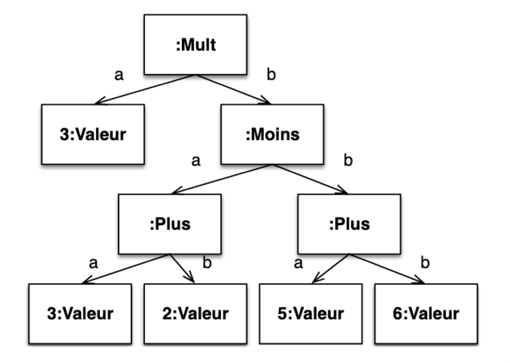
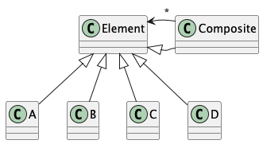
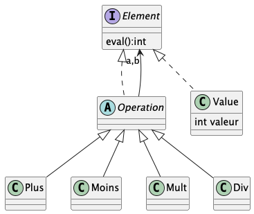
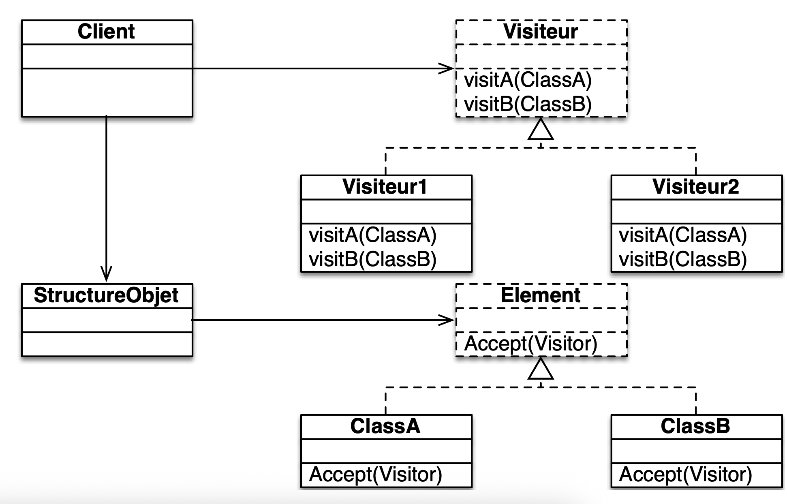
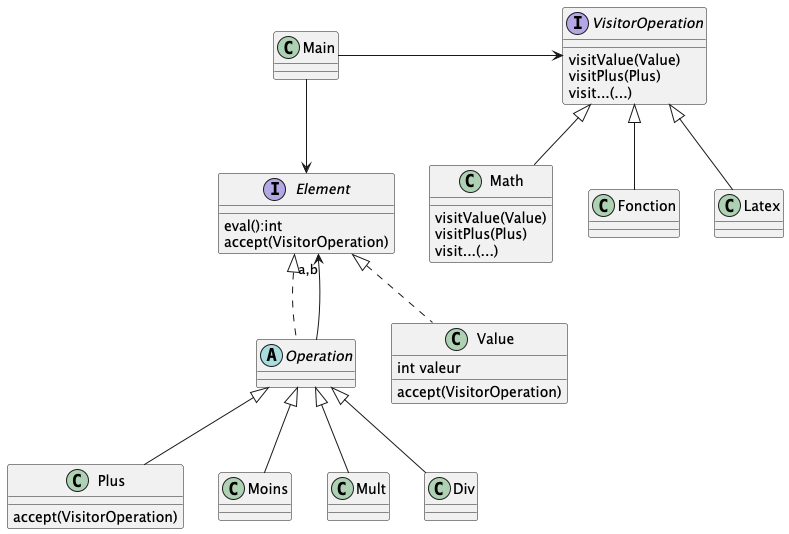

# OperationsMath

Implémnetation d'un coposite et d'un visitor.

## Contexte

L'objectif est de représenter des opérations mathématiques simples (addition, soustraction, multiplication, division) et composées (une opération composée est une opération qui contient d'autres opérations).

Exemple d'opération composée : 

Dans un second temps, il faudra être capable d'afficher ces opérations sous différentes formes textuelles.

Exemple de représentation textuelles pour l'opération composée ci-dessus :
- Forme infixée : (3 * ((3 + 2) - (5 + 6)))
- Forme préfixée : * 3 - + 3 2 + 5 6
- Forme LaTeX : \left( 3 \times \left( \left( 3 + 2 \right) - \left( 5 + 6 \right) \right) \right)

## Problématique

Comment représenter des opérations mathématiques simples et composées de manière modulaire et extensible ?

Comment ajouter de nouvelles opérations ou de nouvelles représentations textuelles sans avoir à modifier le code existant ?

## Solution : Composite et Visitor

## Composite

Le pattern <a href="https://refactoring.guru/fr/design-patterns/composite">Composite</a> permet de représenter des objets composés d'autres objets de manière hiérarchique. Il est particulièrement adapté pour représenter des structures arborescentes comme les opérations mathématiques composées.

Le schéma générique du pattern Composite est le suivant : 

Le package composite du projet propose une implémentation du pattern pour répondre à la création d'opérations mathématiques simples et composées.

En voici la représentation graphique : 

## Visitor

Le pattern <a href="https://refactoring.guru/fr/design-patterns/visitor">Visitor</a> permet de séparer un algorithme de la structure de données sur laquelle il opère. Il est particulièrement adapté pour ajouter de nouvelles opérations sur une structure de données sans avoir à modifier cette structure. 
Il est fortement compatible avec la structure Composite ; permettant de parcourir et décrire les objets de la structure de manière flexible.

Le schéma générique du pattern Visitor est le suivant : 

Le package visitor du projet propose une implémentation du pattern pour répondre à la création de différentes représentations textuelles des opérations mathématiques.

En voici la représentation graphique : 

