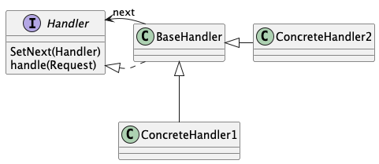
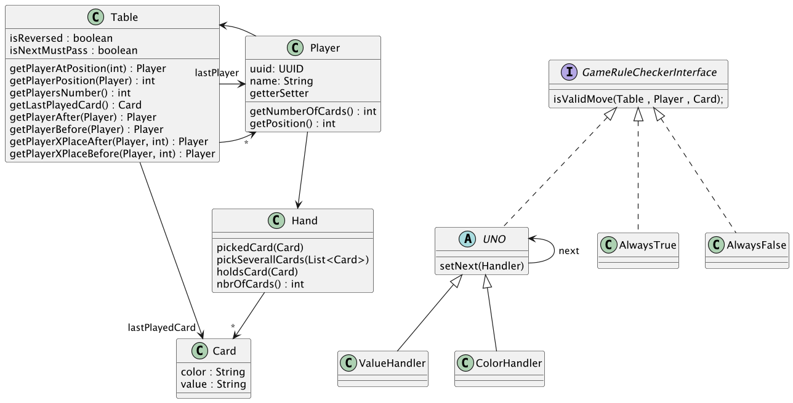

# Mini UNO 

Implémentation d'une chaine de responsabilité.

## Contexte

Le UNO est un jeu de carte dont les règles concernant le tour des joueurs varient fortement en fonction des joueurs. 

Les bases sont : 
- est ce que je suis le joueur après celui qui vient de jouer 
- est ce que la carte que je joue a la même couleur ou valeur que la précédente

Mais il y a des cartes spéciales (changement de sens, +2, +4, interdit de jouer) : 
- dans ces cas, l'ordre du joueur est différent
- les couleurs peuvent être changées

Les regles peuvent changer. Certaines personnes jouent avec des règles "maison"
- je peux jouer si c'est la même couleur ET valeur que la carte précédente
- je peux jouer +2 sur un +2
- etc.

## Problématique 

Comment permettre à des joueurs avec des règles différentes de jouer ensemble sans avoir à modifier le code ? 

Comment ajouter de nouvelles regles sans avoir à modifier le code existant ?

## Solution : Chaine de responsabilité

<a href="https://refactoring.guru/fr/design-patterns/chain-of-responsibility">La chaine de responsabilité</a> est un pattern permettant de rendre modulaire la gestion d'une requete en la faisant passer par une chaine d'objets qui prendront, ou non, la responsabilité de répondre.

Le schema générique de la chaine de responsabilité est le suivant : 

Le projet mini_Uno propose un contexte minimal dans lequel faut implémenter une chaine de responsabilité pour gérer les règles de jeu des joueurs.

Les classes existantes permettent représenter une partie de UNO (Table, joeurs, cartes). Dans le package gameRules il y a deux classes qui permettent respectivement de valider ou d'invalider toute action d'un joueur. 

L'objectif est d'implémenter des classes de règles (UnoGameRuleChecker et héritage) qui pourront être chaînées pour valider ou invalider les actions des joueurs en fonction des règles qu'ils souhaitent appliquer.
